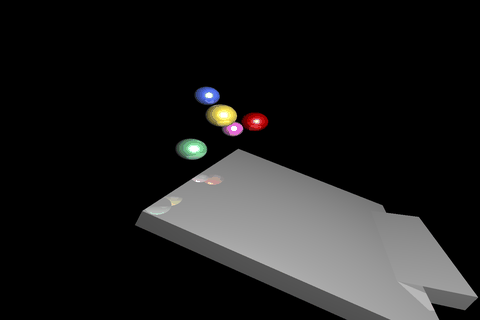

# cuda_rt

# Notes on requirements

pip install swig

sudo apt install build-essential

conda install -c conda-forge cudatoolkit-dev

sudo apt-get install python3-dev

pip3 install opencv-python

sudo apt-get install libgl1-mesa-glx

pip3 install flask

# To build

swig -python -c++ rt.i

nvcc --compiler-options '-fPIC' -c rt.cu rt_wrap.cxx -I/home/a/miniconda3/include/python3.9/ -I/home/a/miniconda3/lib/python3.9/site-packages/numpy/core/include

nvcc -shared rt.o rt_wrap.o -o _rt.so

# To run

python main.py [scenes/some_scene.json]

Defaults to `scenes/demo.json` if no scene is given. Writes rendered frames to `img/`, then
`video.avi` (full quality) and `video.gif` (downscaled, for sharing/embedding -- GitHub renders
`.gif` inline but not `.avi`).

# Scene editor

A browser-based editor for building scenes without hand-editing JSON: fly the camera around a
rasterized Three.js preview, spawn/move/rotate/scale sphere, box, and plane objects, keyframe
positions on a timeline, and bake a physics simulation (per-object gravity/collision, initial
velocity) into keyframes before running the real CUDA render.

python server.py

Then open http://127.0.0.1:5000 in a browser.

- **Viewport**: orbit to look around; "Fly Camera" flies with WASD + mouse and moves the actual
  render camera; `K` inserts a camera keyframe at the current frame while flying.
- **Outliner / Inspector**: spawn spheres/boxes/planes; set material, size, and per-object
  `Gravity` / `Collision` flags plus initial velocity (with optional randomization) for physics.
- **Gizmos**: `1` / `2` / `3` (or the toolbar) switch Move / Rotate / Scale.
- **Timeline**: scrub, drag, or delete position keyframes; play/pause.
- **Bake Physics**: runs the simulation and writes the result as position keyframes.
- **Render**: set the output resolution (Preview/Final presets or exact numbers), then submit the
  scene to the real CUDA renderer as a background job with progress and a preview.

Scenes are plain JSON files under `scenes/` -- `scene_io.py` loads them the same way whether
hand-written or exported from the editor. `scenes/demo.json` and `scenes/primitives_demo.json`
are examples.

